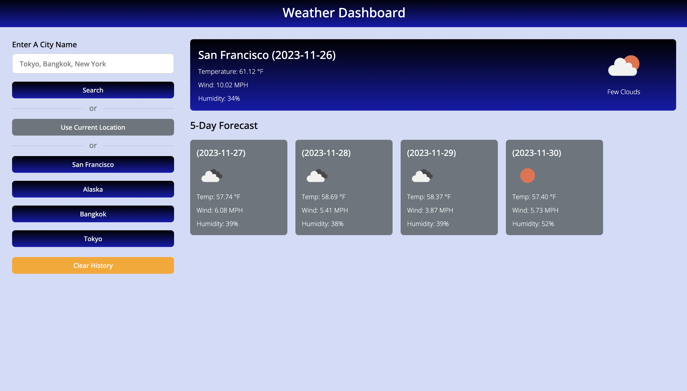
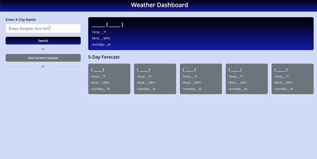

## 06 Server API Weather Challenge

* [Github Repository](https://github.com/KrispyKhang/API-Weather-App)
* [Deployed Github](https://krispykhang.github.io/API-Weather-App/)



## Task
Third-party APIs allow developers to access their data and functionality by making requests with specific parameters to a URL. Developers are often tasked with retrieving data from another application's API and using it in the context of their own. The challenge is to build a weather dashboard that will run in the browser and feature dynamically updated HTML and CSS.

## User Story

```
AS A traveler
I WANT to see the weather outlook for multiple cities
SO THAT I can plan a trip accordingly
```

## Acceptance Criteria

```
GIVEN a weather dashboard with form inputs
WHEN I search for a city
THEN I am presented with current and future conditions for that city and that city is added to the search history
WHEN I view current weather conditions for that city
THEN I am presented with the city name, the date, an icon representation of weather conditions, the temperature, the humidity, and the the wind speed
WHEN I view future weather conditions for that city
THEN I am presented with a 5-day forecast that displays the date, an icon representation of weather conditions, the temperature, the wind speed, and the humidity
WHEN I click on a city in the search history
THEN I am again presented with current and future conditions for that city
```

## Summary
* HTML, CSS, & Javascript were used to create the Server weather app.
* This module 6 assignment uses a server API created on the internet that is accessible for builders.
* Generated an API key to use for the Open Weather API
* Used 4 api urls to obtain data to build. ie: city, longitude, latitude/
* Made conversions for API that uses MPS (Meters per second) instead of MPH and conversion from celsius to farenheight.
* See screenshots below for the finished product.



## Features
 * When types in a city with our OPEN Weather API. They are presented with the temperature(F), the wind speed (MPH), and the humidity %
 * User can also search the city based on their current location.
 * As User searches the city, it is saved on the localStorage. 
 * The search history is presented below the current location button where user can view all the past search histories. 
 * User can also see the clear history button below the past searched histories.
 * If the user types in an incorrect city, there is an alert pop up that says "no coordinates found for (city input)"
* User also has the ability to press enter on their keyboard and it would enter the value without them having to click on the button. 
 
 
 


